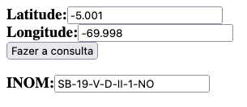

# latlon2grids
Ferramentas para conversão de Latitude e Longitude para os diversos Gris mundiais. 

Ex: 
* Indice de Nomenclatura (INOM) utilizado pelo Sistema Cartográfico Nacional (SCN) Brasileiro;
* Military Grid Reference System used by NATO militaries; e 
* XYZ Tiles

## Implementado
* latlon2inom.py
```
python3 latlon2inom.py 5.3283 -60.1725
NB-20-Z-B-VI-2-SO
```
* latlon2inom.js
```
main(5.3283 -60.1725); 
NB-20-Z-B-VI-2-SO
```
* latlon2inom.html



* latlon2inom.rs
```
rustc latlon2inom.rs
./latlon2inom 5.3283 -60.1725 
NB-20-Z-B-VI-2-SO
```
